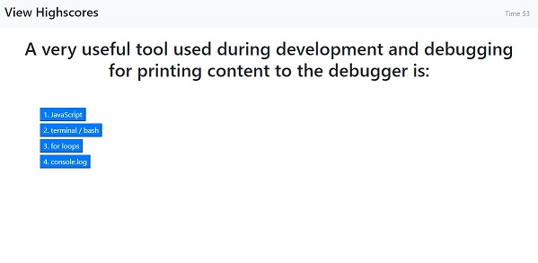
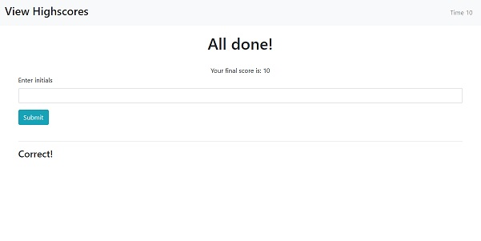
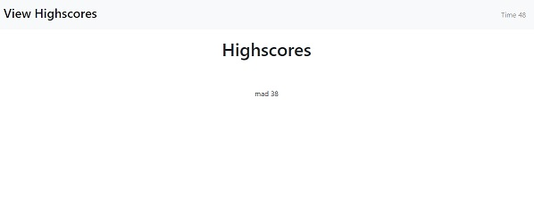

# Code Quiz

```
This website generates a code quiz. It gives you an score based on the time it took you to complete. You have 60 seconds and every time you respond incorrectly it takes away 10 seconds from the time left.
```
```
This is a **link** to the application: https://mariodiosdado.github.io/CodeQuiz/
```

This is an **example** of a question:



This is where you submit your highscore



This is an image of the highscore screen:


